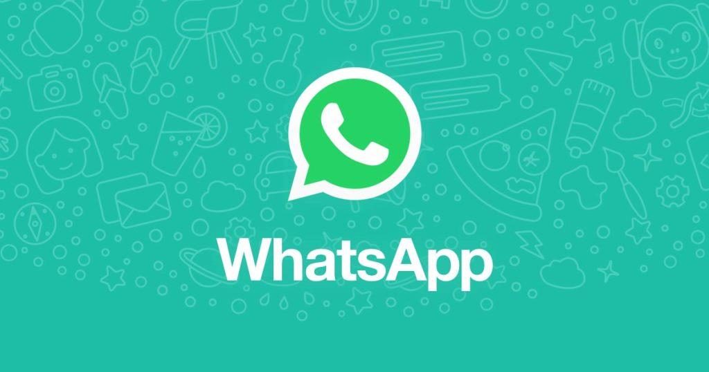
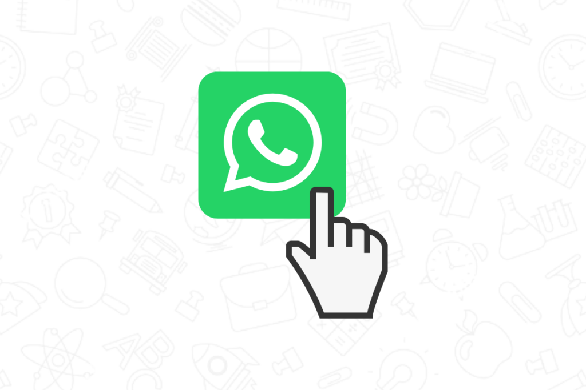

 
>Are you a Business owner? Into Sales & Marketing? Or you just want to know how to create a link that when clicked, customers can send a message to your Business's WhatsApp number without saving the phone (contact)?

**How do you get your customers customers to send you a message on Whatsapp?**

1. Ask your customers to save your phone number (They see this as a stressful task).
2. Create a unique WhatsApp link that does not require clients to save your phone number as a contact(Just a click and you've made a sale).

######WhatsApp's Click to Chat feature allows you to begin a chat with someone without having their phone number saved in your phone's address book. As long as you know this person’s phone number, you can create a link that will allow you to start a chat with them. By clicking the link, a chat with the person automatically opens. Click to Chat works on both your phone and WhatsApp Web.

The first method is excellent, but it requires additional work from the customer. First, the customer needs to find your business phone number, then he has to manually enter the number and save a new contact, wait for Whatsapp to fecth the number and only then they can send you message.

Conversely, the second way is easier, No additional work is needed, the customer needs to click on a link and they can send you a message – without saving the phone.

###Advantages of WhatsApp link without saving a phone

- More efficient – a customer does not need to perform additional operations, which makes it more efficient.
- Suitable for businesses – the link itself is standard for every WhatsApp (Both WhatsApp versions). Especially if you have a WhatsApp for business.
- Easy to Create – Creating a unique link is simple and easy.
- Pre-written message – You can create a pre-prepared message so that when they click on it, the message will be already written and the client only need to click the “Send” button.
- Not only messages but works with most Whatsapp features – this link opens the Whatsapp application given the client the ability to share files, locations, contacts with you, they can also make video/audio calls across to you.
- Easy to share – You can share this link on your website, social media, text messages and almost every other marketing channel.
Mobile Web – This link can be used both in mobile and in Whatsapp Web.
- Click Tracking – You can create an abbreviated link and get the analytics of the link.

####How do I create a link to send messages without adding contacts?
There are two formats for creating a Whatsapp link 
1. The first method to create your link, 
> use **https://api.whatsapp.com/send?phone=(number)** 

where the **(number)** is a full phone number in international format. Omit any zeroes, brackets or dashes when adding the phone number in international format.

> Use: **https://api.whatsapp.com/send?phone=2348078197526**

> Don't use: **https://api.whatsapp.com/send?phone=+2348078197526**

To create your own link with a pre-filled message that will automatically appear in the text field of a chat, 
> use **https://api.whatsapp.com/send?phone=whatsappphonenumber/?text=urlencodedtext** 

where **whatsappphonenumber** is a full phone number in international format and URL-encodedtext is the URL-encoded pre-filled message.

> Example: **https://api.whatsapp.com/send?phone=2348078197526?text=I'm%20interested%20in%20your%20car%20for%20sale**

2. The second method to create your link, 
> use **https://wa.me/(number)** 

where the **(number)** is a full phone number in international format. Omit any zeroes, brackets or dashes when adding the phone number in international format.

> Use: **https://wa.me/2348078197526**

> Don't use: **https://wa.me/+2348078197526**

To create your own link with a pre-filled message that will automatically appear in the text field of a chat, 
> use **https://wa.me/whatsappphonenumber/?text=urlencodedtext**

where **whatsappphonenumber** is a full phone number in international format and URL-encodedtext is the URL-encoded pre-filled message.

> Example:  **https://wa.me/2348078197526?text=I'm%20interested%20in%20your%20car%20for%20sale**

>After clicking on the link, your client will be directed to your Whatsapp contact and they can message you directly.

