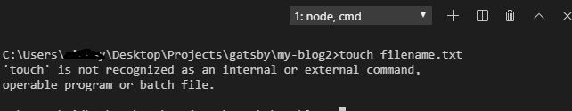
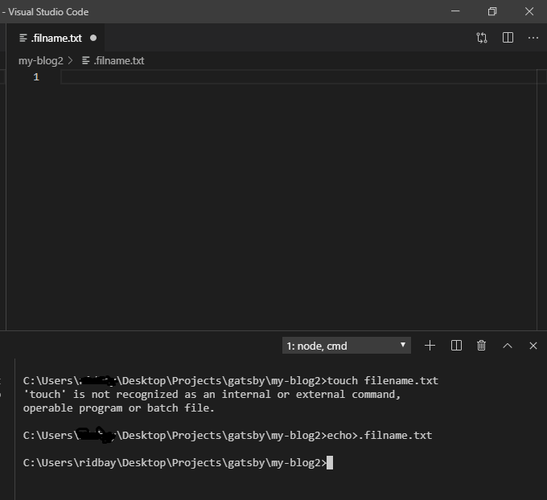

On windows machine, you tried using touch filename.txt and you get an error; 
>'touch' is not recognized as an internal or external command, operable program or batch file.
and the first question that comes to your mind is **"What the Heck!, why is this not working? Do I need to create these files by hand (and modify them to change the timestamp) in order to implement this sort of command?"**

The answer is **"That doesn't seem very node-ish"**
There are windows equivalent of using "touch",

>Windows doesn’t have a native "touch" equivalent, which is a native Linux program that allows you to create empty files and change timestamps.

Below are some of the equivalent commands that you can use to create a file on Windows CMD using 'filename.txt' as an example;

- touch>filename.txt
- copy nul filename.txt
- copy con filename.txt, hit enter, then hit ctrl+z
- cat>filename.txt, hit enter, then hit ctrl+c
- echo > filename.txt
- fsutil file createnew filename.txt 0
- nul > filename.txt
- notepad filename.txt
- bash -c "touch filename.txt"